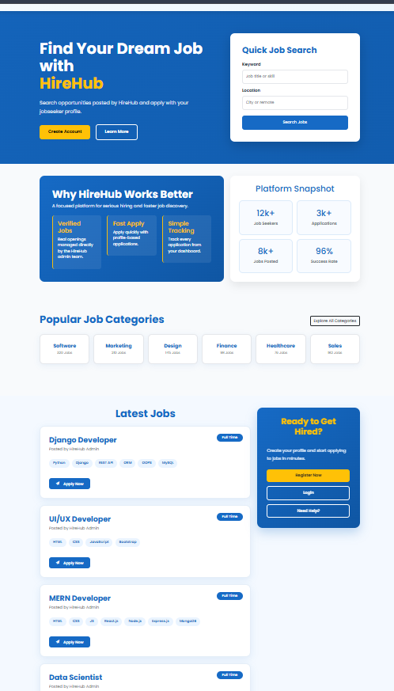
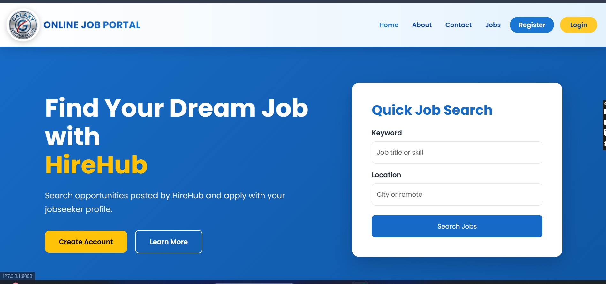
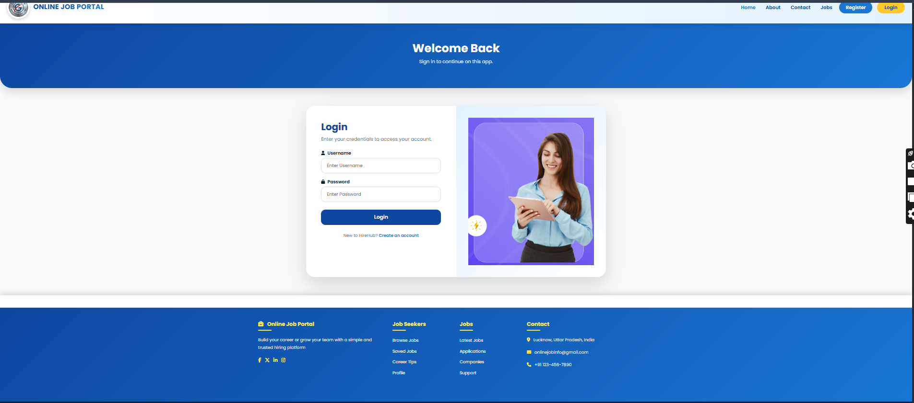
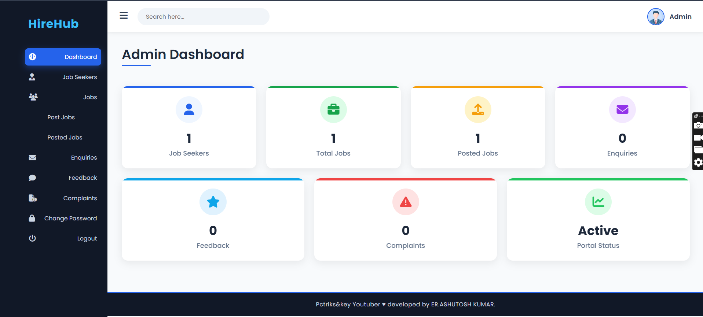
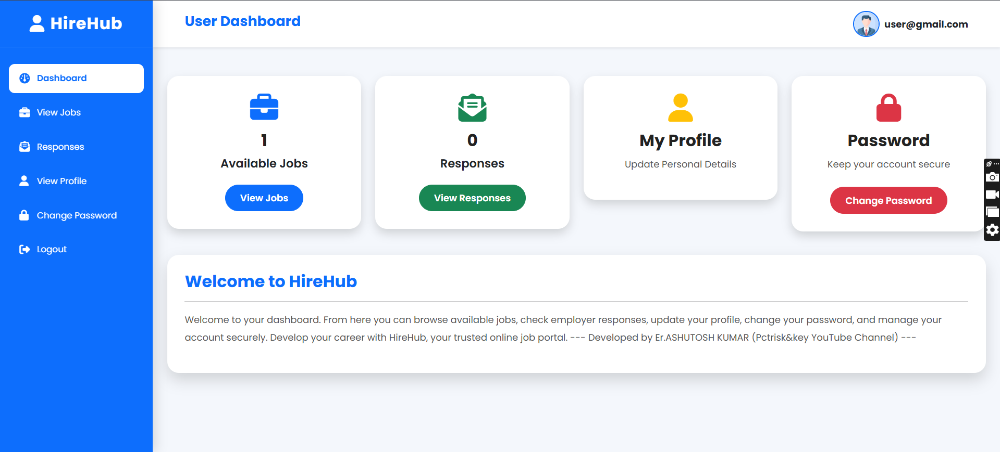

# 💼 Online Job Portal Using Python Django


<p align="center">
  
</p>

<p align="center">

# 🚀 Django Based Online Job Portal

A professional **Online Job Portal** developed using **Python, Django, HTML, CSS, Bootstrap, JavaScript, and SQLite**. The platform enables **Job Seekers**, **Employers**, and **Administrators** to manage the recruitment process efficiently through a secure and user-friendly interface.

</p>

---

# 📌 Project Overview

The Online Job Portal is a web-based recruitment system designed to simplify the hiring process. It allows employers to post jobs, job seekers to search and apply for jobs, and administrators to manage users, job postings, complaints, feedback, and enquiries from a centralized dashboard.

---

# ✨ Key Features

## 👨‍💼 Job Seeker

- User Registration
- Secure Login
- Browse Available Jobs
- Search Jobs
- Apply for Jobs
- View Responses
- Update Profile
- Change Password
- Logout

---

## 🏢 Employer

- Employer Registration
- Employer Login
- Post New Jobs
- Manage Posted Jobs
- View Applications
- Edit Job Details
- Delete Jobs

---

## 🛠️ Admin

- Secure Admin Login
- Dashboard Overview
- Manage Job Seekers
- Manage Employers
- Manage Jobs
- View Posted Jobs
- Manage Enquiries
- Manage Feedback
- Manage Complaints
- Portal Monitoring

---

# 🛠️ Technology Stack

| Technology | Used |
|------------|------|
| Python | ✅ |
| Django | ✅ |
| HTML5 | ✅ |
| CSS3 | ✅ |
| Bootstrap 5 | ✅ |
| JavaScript | ✅ |
| SQLite | ✅ |

---

# 🔐 Demo Login Credentials

## 👤 User Login

| Username | Password |
|----------|----------|
| **user@gmail.com** | **12345** |

---

## 👨‍💻 Admin Login

| Username | Password |
|----------|----------|
| **admin** | **admin123** |

---

# 📸 Project Screenshots

## 🏠 Home Page



---

## 🔐 Login Page



---

## 🛠️ Admin Dashboard



---

## 👤 User Dashboard



---

# 📂 Project Structure

```
Online-Job-Portal
│
├── mainapp
├── templates
├── static
│     ├── css
│     ├── js
│     ├── images
│
├── screenshots
│     ├── project-overview.png
│     ├── home.png
│     ├── login.png
│     ├── admin-dashboard.png
│     └── user-dashboard.png
│
├── media
├── db.sqlite3
├── manage.py
├── requirements.txt
└── README.md
```

---

# ⚙️ Installation

## Clone Repository

```bash
git clone https://github.com/YOUR_USERNAME/online-job-portal.git
```

---

## Open Project

```bash
cd online-job-portal
```

---

## Create Virtual Environment

```bash
python -m venv venv
```

---

## Activate Virtual Environment

Windows

```bash
venv\Scripts\activate
```

Linux / macOS

```bash
source venv/bin/activate
```

---

## Install Dependencies

```bash
pip install -r requirements.txt
```

---

## Apply Migrations

```bash
python manage.py makemigrations
python manage.py migrate
```

---

## Run Server

```bash
python manage.py runserver
```

Open Browser

```
http://127.0.0.1:8000/
```

---

# 📈 Future Improvements

- Resume Upload
- Email Notification
- Job Recommendation
- AI Job Matching
- Company Profiles
- Online Interview Scheduling
- Resume Builder
- Dark Mode
- Mobile Application
- Chat Between Employer & Candidate

---

# 📄 License

This project is licensed under the **MIT License**.

---

# 🤝 Contributing

Contributions are welcome.

1. Fork this Repository
2. Create a New Branch
3. Commit Your Changes
4. Push Your Branch
5. Create a Pull Request

---

# ❤️ Support

If you found this project useful,

⭐ Please **Star** this repository.

📢 Share it with your friends and developers.

---

# 👨‍💻 Developed By

## **Er. Ashutosh Kumar**

**Software Engineer | Python | Django | Full Stack Developer**

🎥 **Pctriks&key YouTube Channel**

---

## ⭐ Show Your Support

If you like this project, don't forget to **⭐ Star this repository** on GitHub.

Thank you for visiting this project. 😊
